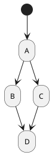

# understand-markdown-graph
A repository to compare chart display in a markdown document

## Flow Chart
### Mermaid
```code
graph TD;
    A-->B;
    A-->C;
    B-->D;
    C-->D;
```

### PlantUML
```code
@startuml
(*) --> "A"
"A" --> "B"
"A" --> "C"
"B" --> "D"
"C" --> "D"
@enduml
```

